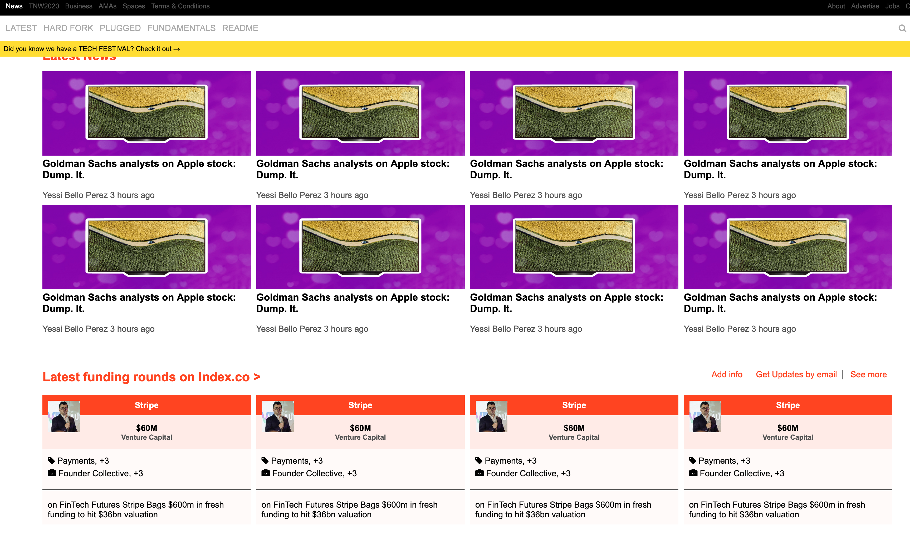
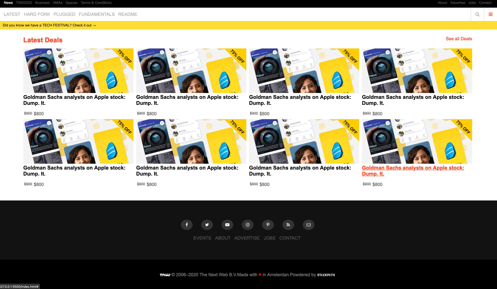

# The Next Web 

> Clone Main Page of The Next Web

## Built With

- HTML
- CSS

## Live Demo

[Live Demo Link](https://rawcdn.githack.com/emasdev/TheNextWeb/ab7c260ae8a1565866b155e6aa426ecfa01c9019/index.html)

## Getting Started

### Prerequisites

- A web browser that can read HTML and CSS

## Authors

👤 **Fernando**

- Github: [@Ferm0494](https://github.com/Ferm0494)
- Twitter: [@ferm494](https://twitter.com/ferm494)
- Linkedin: [@Ferm0494](https://www.linkedin.com/in/ferm0494/)

👤 **Emanuel**

- Github: [@githubhandle](https://github.com/emasdev)

## 🤝 Contributing

Contributions, issues and feature requests are welcome!

Feel free to check the [issues page](issues/).

## Show your support

Give a ⭐️ if you like this project!

## 📝 License

This project is [MIT](lic.url) licensed.
